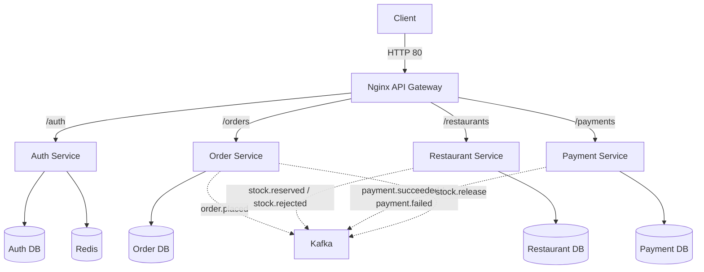

# FoodFlow

FoodFlow is a robust, event-driven microservices backend designed to simulate a food delivery platform. Architecturally, it serves as a technical showcase for distributed systems patterns, specifically focusing on the Saga pattern, Transactional Outbox, and event-driven choreography. It prioritizes reliability and data consistency across independent service boundaries without relying on distributed locks or two-phase commits.

## Key Features

- **Event-Driven Microservices**: Choreography-based saga implementation spanning four independent services.
- **Apache Kafka**: High-throughput message broker handling asynchronous inter-service communication.
- **Saga Pattern**: Distributed transaction management ensuring eventual consistency across bounded contexts.
- **Transactional Outbox**: Guaranteed at-least-once message delivery leveraging PostgreSQL `SELECT ... FOR UPDATE SKIP LOCKED`.
- **Consumer Idempotency**: Bulletproof duplicate message handling via dedicated `processed_events` tracking.
- **Payment Reconciliation Worker**: Background daemon to recover and resolve payments stuck in transient states.
- **Compensating Transactions**: Automatic stock release and order cancellation upon payment failure.
- **JWT Authentication**: Secure stateless user sessions with refresh token rotation.
- **Redis Rate Limiting**: Fail-open IP-based rate limiting to protect the authentication service.
- **Dockerized Deployment**: Complete `docker-compose` orchestration for services, databases, Redis, and Kafka.
- **Prometheus Metrics**: Built-in `/metrics` endpoints for observability and scraping.
- **Integration & Saga Testing**: Comprehensive automated tests verifying concurrency, idempotency, and failure recovery.

## Architecture



## Distributed Transaction Flow

The core order lifecycle operates entirely via asynchronous events.

1. **Client** initiates a POST request to `/orders` via the **Gateway**.
2. **Order Service** validates the request, saves the order as `PENDING`, and writes an `order.placed` event to its outbox in a single database transaction. Returns `202 Accepted`.
3. **Restaurant Service** consumes `order.placed`, attempts to reserve stock, and publishes `stock.reserved` (or `stock.rejected`).
4. **Payment Service** consumes `stock.reserved`, attempts to charge the user via a simulated gateway, and publishes `payment.succeeded` (or `payment.failed`).
5. **Order Service** consumes the payment outcome and transitions the order to `CONFIRMED` or `PAYMENT_FAILED`.
6. *(Compensation)* If payment fails, the Order Service publishes `stock.release`, which the Restaurant Service consumes to restore inventory.

## Reliability Features

- **Saga Pattern**: Instead of a monolithic transaction, the order flow is broken into local database transactions coordinated by domain events. This prevents long-held locks across network boundaries.
- **Transactional Outbox**: Services write domain events to a local `outbox_events` table within the same transaction that updates business state. A background async relay polls this table and publishes to Kafka, ensuring messages are never lost if the process crashes after a DB commit.
- **Consumer Idempotency**: Every Kafka consumer tracks processed `event_id`s in a local `processed_events` table within the same transaction that applies the business logic. Redelivered messages are safely ignored.
- **Payment Reconciliation Worker**: A background task periodically sweeps the Payment database for transactions stuck in the `PROCESSING` state due to process crashes during external gateway calls, ensuring eventual resolution.
- **Compensating Transactions**: Failures in downstream services automatically trigger compensation events (e.g., releasing reserved stock if the payment is rejected) to maintain global business invariants.
- **Eventual Consistency**: The system embraces asynchronous, eventually consistent states, prioritizing high availability and partition tolerance.

## Tech Stack

- **Backend**: Python 3.11, FastAPI, Asyncpg, Aiokafka
- **Messaging**: Apache Kafka (Confluent cp-kafka)
- **Database**: PostgreSQL 16 (Independent databases per service)
- **Caching & Rate Limiting**: Redis 7
- **Infrastructure**: Docker, Docker Compose, Nginx
- **Observability**: Prometheus (`prometheus_client`), Structlog (JSON structured logging)
- **Testing**: Pytest, Httpx (Async HTTP testing)

## Repository Structure

```text
.
├── docker-compose.yml       # Infrastructure & service orchestration
├── nginx/                   # API Gateway configuration
├── scripts/                 # Database initialization and seeding scripts
├── shared/                  # Common libraries (Kafka, Outbox, Middleware, Metrics)
├── services/
│   ├── auth/                # JWT Auth & Redis rate limiting
│   ├── order/               # Order lifecycle & Saga coordination
│   ├── payment/             # Payment processing & Reconciliation
│   └── restaurant/          # Menu catalog & Stock management
└── tests/
    ├── unit/                # Isolated business logic tests
    ├── saga/                # Direct DB tests for concurrency & failure recovery
    └── integration/         # E2E HTTP-driven testing against Docker environment
```

## Getting Started

### Prerequisites
- Docker and Docker Compose
- Python 3.11+ (for local development/testing)

### Clone
```bash
git clone https://github.com/your-org/FoodFlow.git
cd FoodFlow
```

### Environment Variables
The project uses defaults configured directly in the `docker-compose.yml`. No `.env` file is required for initial local development.

### Running Locally
Start the infrastructure and all services:
```bash
docker-compose up --build -d
```
*Note: Kafka and PostgreSQL take a few moments to initialize. Wait for the containers to report healthy.*

The API Gateway will be available at `http://localhost:8085`.

### Running Tests
Ensure the `docker-compose` environment is running, then set up the test environment:
```bash
python -m venv .venv
source .venv/bin/activate  # On Windows: .venv\Scripts\activate
pip install -r requirements-test.txt

# Run all test suites
pytest
```

## Testing

The testing strategy is layered to cover distinct distributed system concerns:
- **Unit Tests**: Validate isolated business logic, state machine transitions, and stock calculation algorithms using dummy mocks.
- **Saga Tests**: Bypass the HTTP layer to directly interact with database pools. These tests validate complex failure modes, including database connection concurrency (`SELECT ... FOR UPDATE`), transaction isolation, outbox crash recovery, and compensating transactions.
- **Integration Tests**: End-to-end tests driving the system via `httpx.AsyncClient` against the running Docker environment to validate the complete HTTP → DB → Kafka → Consumer flow.

## Engineering Decisions

- **Kafka vs Synchronous REST**: Utilizing Kafka decouples services temporally. If the Payment service is temporarily down, the Order service can still accept new orders (returning `202 Accepted`). The system recovers seamlessly once Payment comes back online.
- **Saga vs Two-Phase Commit (2PC)**: 2PC locks resources across services, crippling throughput and introducing single points of failure. The Saga pattern trades strong consistency for high availability and performance, which is acceptable for food delivery flows.
- **Transactional Outbox**: Dual-writing (updating the DB and publishing to Kafka separately) guarantees inconsistencies if the process crashes between the two steps. The Outbox pattern ensures atomic updates to local state and message dispatch intent.
- **Consumer Idempotency**: "Exactly-once" delivery is mathematically impossible over unreliable networks. We embrace "at-least-once" delivery from Kafka and rely on local `processed_events` tracking to achieve "exactly-once" *processing*.
- **Separate Databases**: Each service defines its own connection string and schema, strictly enforcing bounded contexts. Services cannot perform SQL JOINs across domain boundaries; they must communicate via APIs or Events.
- **Redis**: Used exclusively by the Auth service for sliding-window rate limiting. It's designed to "fail-open" so that a Redis outage does not block authentication.

## Known Limitations

This project is a technical showcase. In a true production environment, the following improvements would be necessary:
- **Server-Side Authoritative Pricing**: The Order service currently accepts the `total_amount` dictated by the client payload. This must be validated against the Restaurant service's source-of-truth menu to prevent price manipulation.
- **Gateway Idempotency in Reconciliation**: The payment reconciliation script retries stuck charges blindly. It should utilize an idempotency key (like the payment ID) when communicating with the external payment gateway to avoid double-charging the customer.
- **Distributed Tracing**: While JSON structured logging and Request IDs are present, integrating OpenTelemetry (Jaeger/Zipkin) would vastly improve observability across async event hops.
- **Connection Pool Exhaustion Risks**: The current Outbox relay holds a database transaction open while awaiting network confirmation from Kafka. This blocks connections and should be decoupled.
- **Deadlock Risks**: Stock reservation lacks a deterministic sort order for menu items, which can trigger Postgres deadlocks under highly concurrent competing orders.

## Future Improvements

- Migrate to a Schema Registry (e.g., Protobuf/Avro) for strict Kafka event contracts.
- Implement a dedicated API Gateway (e.g., Kong or Envoy) to handle TLS termination, unified rate-limiting, and JWT validation.
- Implement WebSockets or Server-Sent Events (SSE) to push real-time order status updates to the client.

## License

No license specified.
