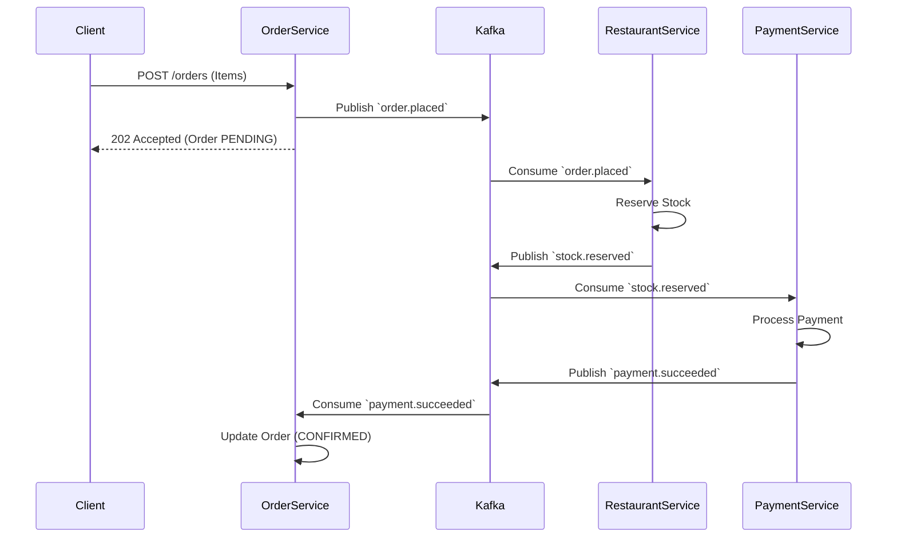

# FoodFlow v2

A production-inspired food ordering backend demonstrating microservices, event-driven architecture, a choreographed saga, transactional outboxes, and consumer idempotency. 

Built with FastAPI, PostgreSQL, Kafka, and Redis.

## Architecture

This project deliberately avoids massive enterprise complexity (like Kubernetes, Service Meshes, or Temporal) while demonstrating how to solve real distributed systems problems.


### Services

- **Auth Service:** JWT issuance, Redis sliding-window rate limiting.
- **Order Service:** Entry point for orders. Maintains state transitions (`PENDING` -> `CONFIRMED` / `FAILED`).
- **Restaurant Service:** Menu and stock management. Idempotent stock reservations.
- **Payment Service:** Deterministic payment simulator enforcing a two-transaction flow to avoid uncertain state.

### Saga (Choreographed)

When an order is created, it kicks off a choreographed saga:



**Compensation Path:**
If payment fails, `PaymentService` publishes `payment.failed`. `OrderService` sets status to `PAYMENT_FAILED` and publishes `stock.release`. `RestaurantService` consumes `stock.release` and restores the stock.

## Key Design Decisions

1. **Transactional Outbox Pattern**
   Whenever a service modifies business data *and* publishes an event (e.g., placing an order and emitting `order.placed`), both happen in the same Postgres transaction. A background relay (`SELECT ... FOR UPDATE SKIP LOCKED`) publishes the events. This guarantees we never save state without emitting the event, or vice-versa.

2. **Consumer Idempotency**
   Kafka guarantees at-least-once delivery. Every consumer checks a `processed_events` table within its business transaction to ensure duplicate events are safely ignored.

3. **Database-per-Service**
   Four isolated PostgreSQL databases. Services only communicate via Kafka or API gateways. No shared schema.

4. **Fail-open Redis**
   Redis is used for rate limiting. If Redis fails, the system logs a warning but continues serving authenticated requests. Redis is an optimization, not a hard dependency for business logic.

5. **No Generic Consumer Base Classes**
   To keep the codebase readable, each service explicitly owns its `aiokafka` consumer loop. No complex inheritance or abstract factories.

6. **Deterministic Payment Simulator**
   Payment success/failure isn't random. It's controlled via the `X-Payment-Simulate` HTTP header propagated through the Kafka events, making tests 100% reproducible.

## What I intentionally did NOT implement

To keep this project focused on core backend principles, the following "platform-scale" patterns were omitted:

- **Dead Letter Queues (DLQ):** In production, unprocessable messages would go to a DLQ for manual review. Here, we just log them.
- **Distributed Tracing:** Request IDs are implemented for logs, but full OpenTelemetry/Jaeger tracing was omitted to reduce infrastructure overhead.
- **Event Versioning / Schema Registry:** We use a simple JSON envelope. In a larger org, Avro/Protobuf with a Schema Registry would enforce compatibility.
- **Reconciliation Workers:** Background jobs to catch stuck orders. The saga is reliable enough for this scope.
- **Kubernetes:** Docker Compose is sufficient to demonstrate the architecture locally.

## Running the Project

### Prerequisites
- Docker and Docker Compose

### Start the cluster
```bash
docker compose up --build -d
```
*Note: PostgreSQL is pre-seeded with sample restaurants and menus.*

### Run Integration Tests
```bash
# Make sure the cluster is running first!
docker compose exec order-service pytest tests/integration -v
```

## Manual Verification Flow

```bash
# 1. Register
curl -X POST http://localhost:8080/auth/register \
  -H "Content-Type: application/json" \
  -d '{"email":"demo@example.com","password":"password123"}'

# 2. Login
TOKEN=$(curl -s -X POST http://localhost:8080/auth/login \
  -H "Content-Type: application/json" \
  -d '{"email":"demo@example.com","password":"password123"}' | jq -r .access_token)

# 3. Create an order (Restaurant and Item UUIDs are from seed data)
ORDER_ID=$(curl -s -X POST http://localhost:8080/orders \
  -H "Authorization: Bearer $TOKEN" \
  -H "Content-Type: application/json" \
  -d '{
    "restaurant_id": "a1b2c3d4-e5f6-7890-abcd-ef1234567890",
    "items": [{"item_id": "11111111-1111-1111-1111-111111111111", "quantity": 1, "price": 9.99}]
  }' | jq -r .id)

# 4. Check status (Should transition from PENDING to CONFIRMED within ~2 seconds)
curl -s http://localhost:8080/orders/$ORDER_ID \
  -H "Authorization: Bearer $TOKEN" | jq .
```
