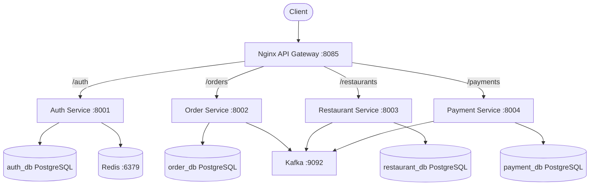
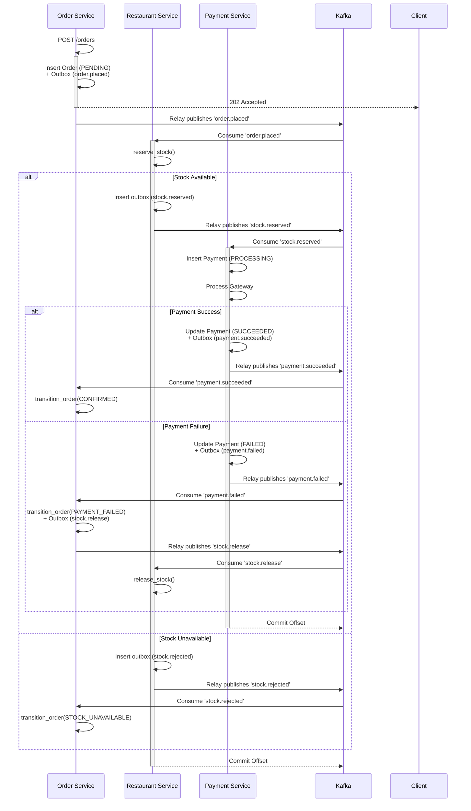

# Phase 1: Complete Mental Model

## Architecture Diagram

## Repository Structure

The `resto2` repository is a microservices-based application containing four independent domain services, a shared utility package, API Gateway, and infrastructure components.

### Infrastructure & Configuration
- `docker-compose.yml`: Defines the entire environment—PostgreSQL, Redis, Kafka (single node kraft), Nginx API Gateway, and the four python services.
- `nginx/nginx.conf`: Nginx API Gateway configuration. Provides single-entry point routing on port 80 (exposed as 8085 on host) via path prefixes to individual services (`/auth`, `/orders`, `/restaurants`, `/payments`).
- `scripts/init-databases.sql`: Executed by the PostgreSQL container on first startup to create the four distinct databases (`auth_db`, `order_db`, `restaurant_db`, `payment_db`).

### Shared Library (`shared/`)
A common Python package mounted/copied into all services. Provides shared infrastructure plumbing without dictating domain logic.
- `__init__.py`: Empty, makes it a package.
- `events.py`: Standardized Kafka event envelope generator (`wrap_event`). Ensures all events have `event_id`, `event_type`, `occurred_at`, and `payload`.
- `health.py`: Database health check factory (`create_health_router`).
- `kafka.py`: Kafka producer/consumer factories (`create_producer`, `create_consumer`).
- `metrics.py`: Prometheus metrics definitions and the `/metrics` endpoint.
- `middleware.py`: Request ID generation/propagation and structured JSON logging (`structlog`).
- `outbox.py`: Transactional outbox relay background task. Polls `outbox_events` and publishes to Kafka.

### Services (`services/`)
Each service is self-contained with its own FastAPI application, database pool, and optional Kafka components.
#### Auth Service (`services/auth/`)
Handles JWT-based user authentication and rate limiting.
- `main.py`: Entrypoint. Initializes DB pool, Redis client, middleware, and routes.
- `auth.py`: Cryptography logic (bcrypt password hashing, PyJWT token creation/verification).
- `db.py`: Asyncpg pool creation and migration runner.
- `models.py`: Pydantic models (Register, Login, Refresh).
- `rate_limiter.py`: IP-based Redis sliding-window rate limiter middleware with fail-open behavior.
- `redis_client.py`: Singleton Redis client connection manager.
- `routes.py`: API Endpoints (`/register`, `/login`, `/refresh`).
- `migrations/001_init.sql`: Creates `users` and `refresh_tokens` tables.

#### Order Service (`services/order/`)
Handles order creation and state management. Acts as the saga orchestrator (via choregraphy responses).
- `main.py`: Entrypoint. Manages DB pool, Kafka producer, background consumer, and outbox relay.
- `consumers.py`: Kafka consumer loop for `payment.succeeded`, `payment.failed`, and `stock.rejected`. Transitions order states.
- `db.py`: DB pool setup and migrations.
- `models.py`: Pydantic request/response models.
- `routes.py`: API Endpoints (`POST /orders`, `GET /orders/{id}`). Validates JWTs.
- `state_machine.py`: Whitelisted state transition logic (`PENDING` -> `CONFIRMED` | `PAYMENT_FAILED` | `STOCK_UNAVAILABLE`).
- `migrations/001_init.sql`: Creates `orders`, `outbox_events`, `processed_events`.

#### Restaurant Service (`services/restaurant/`)
Manages menus and inventory (stock).
- `main.py`: Entrypoint. Similar to Order service (DB, Producer, Consumer, Outbox).
- `consumers.py`: Kafka consumer for `order.placed` (triggers reservation) and `stock.release` (compensation).
- `db.py`: DB pool and migrations.
- `models.py`: Pydantic models.
- `routes.py`: API Endpoints (`GET /restaurants`, `GET /restaurants/{id}/menu`).
- `stock.py`: Core inventory logic (`reserve_stock`, `release_stock`) using `SELECT ... FOR UPDATE`.
- `migrations/001_init.sql`: Tables `restaurants`, `menu_items`, `menu_item_stock`, `stock_reservations`, `outbox_events`, `processed_events`.
- `migrations/002_seed.sql`: Initial mock data.

#### Payment Service (`services/payment/`)
Simulates payment processing.
- `main.py`: Entrypoint. DB, Producer, Consumer, Outbox.
- `consumers.py`: Kafka consumer for `stock.reserved`. Executes two-transaction payment pattern.
- `db.py`: DB pool and migrations.
- `gateway.py`: Deterministic mock payment gateway simulator based on `X-Payment-Simulate` header.
- `models.py`: Pydantic models.
- `routes.py`: API Endpoint (`GET /payments/order/{id}`).
- `migrations/001_init.sql`: Tables `payments`, `outbox_events`, `processed_events`.

## Dependency Graph

**Service to Datastore:**
- Auth Service -> PostgreSQL (`auth_db`), Redis
- Order Service -> PostgreSQL (`order_db`), Kafka
- Restaurant Service -> PostgreSQL (`restaurant_db`), Kafka
- Payment Service -> PostgreSQL (`payment_db`), Kafka

**Service to Shared Libraries:**
- All Services -> `shared.middleware`, `shared.health`, `shared.metrics`
- Order, Restaurant, Payment -> `shared.kafka`, `shared.outbox`, `shared.events`

**Event Dependencies (Choreography Saga):**
- Order Service produces `order.placed` -> Restaurant Service consumes
- Restaurant Service produces `stock.reserved` -> Payment Service consumes
- Restaurant Service produces `stock.rejected` -> Order Service consumes
- Payment Service produces `payment.succeeded` | `payment.failed` -> Order Service consumes
- Order Service produces `stock.release` -> Restaurant Service consumes

## Startup Flow

Tracing `docker compose up --build`:
1. **Docker Daemon**: Parses `docker-compose.yml`.
2. **Network Creation**: A default bridge network is created.
3. **Volume Creation**: `postgres_data` volume is created/attached.
4. **Image Builds**: Docker builds `auth-service`, `order-service`, `restaurant-service`, `payment-service` from their respective Dockerfiles.
5. **Infrastructure Startup**:
   - `postgres` starts. Runs `scripts/init-databases.sql` on first boot, creating the 4 databases. Healthcheck `pg_isready` polls until ready.
   - `redis` starts. Healthcheck `redis-cli ping` polls until ready.
   - `kafka` starts (Kraft mode, broker+controller). Healthcheck `kafka-topics --list` polls until ready.
6. **Microservice Startup**:
   - Conditioned on infrastructure healthchecks, the Python services start via `uvicorn main:app`.
7. **Python / FastAPI Lifespan**:
   - Python interprets imports, instantiating global loggers (`structlog`) and global configuration variables.
   - FastAPI `lifespan` context manager begins:
     - **Auth**: Connects to `auth_db`, applies SQL migrations, establishes Redis pool (`get_redis()`).
     - **Order / Restaurant / Payment**: Connects to their respective DBs, applies SQL migrations. Creates Kafka `AIOKafkaProducer`.
     - Creates `asyncio.Event()` for shutdown signaling.
     - Spawns background `asyncio` tasks: `run_consumer` and `run_outbox_relay`.
8. **HTTP Ready**: Uvicorn binds to port (8001/8002/8003/8004) and is ready for traffic.
9. **Nginx Startup**: `nginx` starts (depends on services). Loads `nginx.conf` and begins routing traffic on port 8085 (host).

## Request Control Flow

Example: `POST /orders`
1. **Client** -> POST `http://localhost:8085/orders/`
2. **Gateway**: Nginx matches `/orders/`, proxies to `http://order_service:8002/orders/`, injecting `X-Real-IP`.
3. **Middleware**:
   - `RequestIdMiddleware` intercepts. Generates `uuid4` if no `X-Request-ID` is present. Binds ID to `structlog` context and `request.state`.
4. **Dependencies**:
   - FastAPI evaluates `Depends(get_current_user)`.
   - Extracts `Bearer <token>`, decodes with `jwt.decode` using `JWT_SECRET`. Raises 401 if invalid/expired.
5. **Validation**: Pydantic validates `CreateOrderRequest` body.
6. **Business Logic**:
   - Calculates total amount.
   - Generates event payload. Calls `wrap_event("order.placed", ...)`
7. **Database (Transactional Outbox)**:
   - Acquires connection from asyncpg pool.
   - Begins transaction (`async with conn.transaction():`)
   - `INSERT INTO orders` (status='PENDING')
   - `INSERT INTO outbox_events` (topic='order.placed')
   - Commits transaction.
8. **Logging**: `logger.info("order_created", ...)`
9. **Response**: FastAPI returns `202 Accepted` JSON representation.
10. **Metrics**: Middleware calculates duration, increments `http_requests_total` and observes `http_request_duration_seconds`.

## Event Flow (Choreographed Saga)

## Database Mapping

All tables use `gen_random_uuid()` for IDs.

### 1. auth_db (Auth Service)
* `users`: `id` (PK), `email` (Unique), `password_hash`, `created_at`.
  - **Why:** Core identity store.
* `refresh_tokens`: `id` (PK), `user_id` (FK->users ON DELETE CASCADE), `token_hash`, `expires_at`, `created_at`.
  - **Indexes:** `idx_refresh_tokens_user`, `idx_refresh_tokens_hash`
  - **Why:** Secure persistence of refresh tokens for long-lived sessions.

### 2. order_db (Order Service)
* `orders`: `id` (PK), `user_id` (UUID), `restaurant_id` (UUID), `items` (JSONB), `total_amount` (DECIMAL), `status` (VARCHAR), `payment_simulate` (VARCHAR), `created_at`, `updated_at`.
  - **Indexes:** `idx_orders_user`, `idx_orders_status`.
  - **Why:** System of record for orders. Lifecycle: PENDING -> CONFIRMED | PAYMENT_FAILED | STOCK_UNAVAILABLE.
* `outbox_events`: `id` (PK), `topic`, `key`, `payload` (JSONB), `created_at`, `published_at` (Nullable).
  - **Index:** `idx_outbox_unpublished` (partial index).
  - **Why:** Transactional outbox relay target.
* `processed_events`: `event_id` (PK), `processed_at`.
  - **Why:** Idempotency store for Kafka consumers. Prevents double-processing.

### 3. restaurant_db (Restaurant Service)
* `restaurants`: `id` (PK), `name`, `description`, `created_at`.
* `menu_items`: `id` (PK), `restaurant_id` (FK), `name`, `description`, `price`, `created_at`.
* `menu_item_stock`: `item_id` (PK FK->menu_items), `quantity` (INT, CHECK>=0), `updated_at`.
  - **Why:** Inventory tracking.
* `stock_reservations`: `id` (PK), `order_id` (Unique), `items` (JSONB), `created_at`.
  - **Why:** Compensation log. If payment fails, this record tells us exactly what to put back.
* `outbox_events` & `processed_events`: Identical to Order DB.

### 4. payment_db (Payment Service)
* `payments`: `id` (PK), `order_id` (Unique), `amount`, `status`, `created_at`, `updated_at`.
  - **Why:** System of record for financial transactions. Lifecycle: PROCESSING -> SUCCEEDED | FAILED.
* `outbox_events` & `processed_events`: Identical to Order DB.

## Redis Mapping

Redis is used exclusively by the **Auth Service**.
- **Key Format**: `rate_limit:{client_ip}` (e.g. `rate_limit:127.0.0.1`)
- **Type**: String (Integer counter)
- **TTL**: 60 seconds (`WINDOW_SECONDS`)
- **Purpose**: Tracks number of requests from an IP within the sliding window. Max 30 requests.
- **Writers/Readers**: `RateLimitMiddleware` (Auth service) executes `INCR`. If 1, sets `EXPIRE`. Reads the result to reject if >30.
- **Deletion**: Automatic via TTL expiry.

## External Systems & Libraries
- **PostgreSQL**: Primary transactional persistence. Isolated per service.
- **Redis**: Rate limiting data store.
- **Kafka**: Asynchronous event broker for inter-service communication (Choreographed Saga).
- **Prometheus**: Metric scraping. Each service exposes `/metrics` via the `prometheus_client` library.
- **Nginx**: API Gateway. Reverse proxy routing based on URI prefixes.
- **asyncpg**: High-performance asyncio PostgreSQL driver.
- **structlog**: Structured JSON logging.
- **aiokafka**: Asyncio Kafka client.
- **FastAPI / Pydantic**: HTTP Framework and data validation.
- **PyJWT / bcrypt**: Security standards implementation.

## Configuration Flow

1. `.env` file (implicit in docker-compose) / Environment variables set in `docker-compose.yml` (e.g., `DATABASE_URL`, `KAFKA_BOOTSTRAP_SERVERS`, `JWT_SECRET`, `PAYMENT_SIMULATE_DEFAULT`).
2. Loaded via `os.getenv()` at the module level in target files (e.g., `db.py`, `auth.py`, `kafka.py`, `gateway.py`).
3. Evaluated during Python import phase.
4. Bound to global constants or factory functions. No Pydantic Settings classes are used in this repository.

## Authentication Flow

1. **Token Creation** (`POST /login`): Validates bcrypt password. Generates short-lived `access_token` (JWT, HS256, 15 min) and long-lived `refresh_token` (random string, 7 days).
2. **Storage**: `access_token` is stateless (not stored). `refresh_token` is hashed (SHA-256) and stored in `auth_db.refresh_tokens`.
3. **Request**: Client sends `Authorization: Bearer <access_token>` to Order/Restaurant/Payment routes.
4. **Validation**: Target service extracts token. Validates signature via `jwt.decode(..., JWT_SECRET)`. (Services share the `JWT_SECRET` env var).
5. **Authorization**: Order service extracts `user_id` from token payload. Checks if `user_id` matches the `order.user_id` before returning details.
6. **Refresh** (`POST /refresh`): Client sends raw `refresh_token`. Auth service hashes it, looks it up in DB. If valid & unexpired, deletes the old row and issues a new pair (Refresh Token Rotation).

## Order / Inventory / Payment Lifecycle (Saga)

**Birth**: `POST /orders`. Order is inserted into `orders` table as `PENDING`. `order.placed` event goes to outbox. HTTP 202 returned.
**Inventory (Reservation)**: Restaurant service consumes `order.placed`. Begins transaction. Checks `menu_item_stock` via `SELECT ... FOR UPDATE` row locks. Deducts quantity, creates `stock_reservations` record. Commits transaction. `stock.reserved` outbox event inserted.
**Payment**: Payment service consumes `stock.reserved`. Begins transaction. Inserts payment as `PROCESSING`. Calls `gateway.py` (simulating network call). Updates payment to `SUCCEEDED` (or `FAILED`). Commits transaction with outbox event `payment.succeeded` (or `.failed`).
**Completion (Success)**: Order service consumes `payment.succeeded`. Updates order status to `CONFIRMED`.
**Completion (Failure)**: Order service consumes `payment.failed`. Updates order status to `PAYMENT_FAILED`. Puts `stock.release` into outbox.
**Inventory (Compensation)**: Restaurant service consumes `stock.release`. Retrieves `stock_reservations`, adds quantity back to `menu_item_stock`. Deletes reservation record.

## Failure Paths

- **Database Fails**: HTTP requests fail 500. `health.py` fails. Outbox relay loops with errors but doesn't crash. Consumers crash their task, but `asyncio.gather` handles it or the container restarts.
- **Kafka Fails**: Producers buffer locally then fail. Consumers disconnect and retry. Outbox relay loops but cannot publish, events remain safely in PostgreSQL.
- **Redis Fails**: `rate_limiter.py` catches connection exceptions and **fails open**. Requests proceed without rate limiting, logging a warning.
- **Payment Gateway Fails/Rejects**: Simulator returns False. Payment service emits `payment.failed`. Order service compensates by emitting `stock.release`.
- **Timeout occurs during Payment**: The two-transaction design in Payment service ensures that the intent is recorded as `PROCESSING` before calling the gateway.
- **Duplicate Request / Event**: Every consumer does a `SELECT 1 FROM processed_events WHERE event_id = $1` inside the transaction. Duplicates are silently ignored.
- **Service Crashes mid-request**: Due to transactional boundaries (ACID DB, Transactional Outbox), data is never left in a partial state.

## Object Lifecycle

- **Request / Response**: Instantiated by Uvicorn/FastAPI per HTTP request. Destroyed after response is sent.
- **DB Connection Pool (`asyncpg.Pool`)**: Created in `lifespan` startup phase. Lives for the duration of the application. Owned by `app.state.db_pool`. Closed during `lifespan` shutdown.
- **DB Connection (`asyncpg.Connection`)**: Acquired temporarily inside routes or consumer loops (`async with pool.acquire()`). Returned to pool immediately after use.
- **Redis Client**: Singleton global variable `_redis_client` initialized lazily on first use. Lives indefinitely until shutdown.
- **Kafka Producer (`AIOKafkaProducer`)**: Created in `lifespan`. Owned by `app.state.producer`. Closed in shutdown.
- **Kafka Consumer (`AIOKafkaConsumer`)**: Created inside `run_consumer` task. Bound to the consumer loop. Closed in `finally` block on task exit.
- **Logger (`structlog`)**: Global configuration. Instantiated once per file. Bound context variables live for the duration of the request context.

## Runtime Timeline
1. **t=0**: Docker daemon issues `up`. Network and volumes allocated.
2. **t=1**: `postgres`, `redis`, `kafka` containers begin starting.
3. **t=10**: `postgres` executes `init-databases.sql`.
4. **t=15**: Infrastructure healthchecks pass. Microservice containers start.
5. **t=16**: Python boots. Modules imported. Global variables (`DATABASE_URL`, `JWT_SECRET`) loaded. `structlog` configured.
6. **t=17**: FastAPI `lifespan` enters.
7. **t=18**: `asyncpg` pools created. Migrations run via `db.py`.
8. **t=19**: Kafka producers connect.
9. **t=20**: `asyncio.create_task` spawns consumer loop and outbox relay loop.
10. **t=21**: Uvicorn binds to port 800X.
11. **t=22**: `nginx` API gateway starts and proxies port 8085.
12. **t=X**: Request arrives. Processed via Middleware -> Router -> DB -> Response.
13. **t=Y**: `SIGTERM` received. FastAPI `lifespan` exits. `shutdown_event.set()` called.
14. **t=Y+1**: Consumer loops process final batch and exit. Outbox relay performs final flush.
15. **t=Y+2**: Kafka producers/consumers closed. DB pools closed. Process exits.

---

# Phase 2: Teaching Index Curriculum

Below is the structured roadmap for explaining this repository from first principles, organized in dependency order.

### Module 1: The Infrastructure Layer
1. **Docker Ecosystem**: Exploring `docker-compose.yml`, networking, volumes, and healthchecks.
2. **Database Initialization**: Understanding `scripts/init-databases.sql` and the database-per-service isolation pattern.
3. **API Gateway**: Analyzing `nginx.conf`, path prefix routing, and header injection.

### Module 2: The Core FastAPI Framework & Configuration
1. **Entrypoints & Lifespans**: Breaking down `main.py` and the FastAPI `lifespan` context manager.
2. **Configuration Management**: How environment variables flow from `docker-compose` to `.env` to `os.getenv()` in Python.
3. **Routing & Dependency Injection**: Analyzing `routes.py`, APIRouters, and custom dependencies (e.g., `Depends(get_current_user)`).

### Module 3: Observability & Middleware (The Shared Package)
1. **Structured Logging**: How `structlog` works and how context variables are bound.
2. **Request Tracing**: `RequestIdMiddleware` generating and propagating `X-Request-ID`.
3. **Metrics**: Exploring `prometheus_client` in `shared/metrics.py` and the `/metrics` endpoint.
4. **Health Checks**: Database connectivity polling via `shared/health.py`.

### Module 4: The Database Layer (asyncpg)
1. **Connection Pooling**: How `asyncpg.create_pool` is configured in `db.py`.
2. **Migrations Strategy**: The lightweight custom migration runner on startup.
3. **JSONB Serialization**: Applying custom PostgreSQL codecs for seamless Python dict mapping.

### Module 5: Authentication & Authorization (Auth Service)
1. **Identity Schema**: Mapping the `users` and `refresh_tokens` tables.
2. **Password Cryptography**: Hashing and verification with `bcrypt`.
3. **JWT Mechanics**: Access vs. Refresh tokens, signing with HS256, and rotation logic.
4. **Fail-Open Rate Limiting**: Analyzing `RateLimitMiddleware` and resilient `redis.asyncio` integration.

### Module 6: Asynchronous Event-Driven Patterns (Kafka)
1. **Kafka Topologies**: Exploring topics, partitions, and consumer groups in this project.
2. **Producers & Consumers**: Analyzing `shared/kafka.py` factory methods and serialization.
3. **The Transactional Outbox Pattern**: Deep dive into `outbox.py`. Why we use `SELECT ... FOR UPDATE SKIP LOCKED` and how it guarantees at-least-once delivery.
4. **Consumer Idempotency**: How the `processed_events` table ensures exactly-once processing semantics.

### Module 7: Distributed Transactions (The Choreographed Saga)
1. **Order Creation (The Initiator)**: Breaking down `POST /orders` and the `PENDING` state.
2. **Inventory Reservation**: Understanding `SELECT ... FOR UPDATE` locks in `restaurant/stock.py`.
3. **Payment Simulation**: The two-transaction pattern in `payment/consumers.py` to handle external gateway unreliability.
4. **Compensation Flows**: How `payment.failed` triggers `stock.release` to roll back the distributed transaction.
5. **State Machine Enforcement**: Exploring `state_machine.py` and strictly whitelisted transitions.

### Module 8: Graceful Shutdown Lifecycle
1. **Signal Handling**: How `SIGTERM` triggers the `shutdown_event`.
2. **Task Cleanup**: Utilizing `asyncio.gather` for background consumer/relay tasks.
3. **Resource Teardown**: Properly draining and closing Kafka clients and DB pools.
